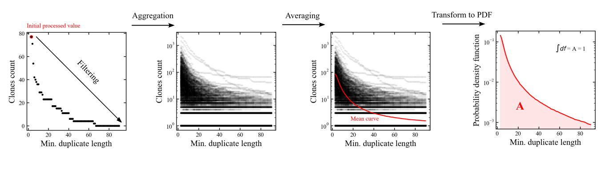
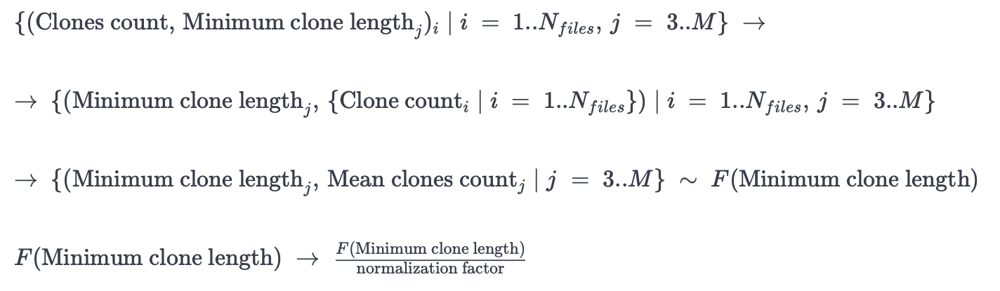
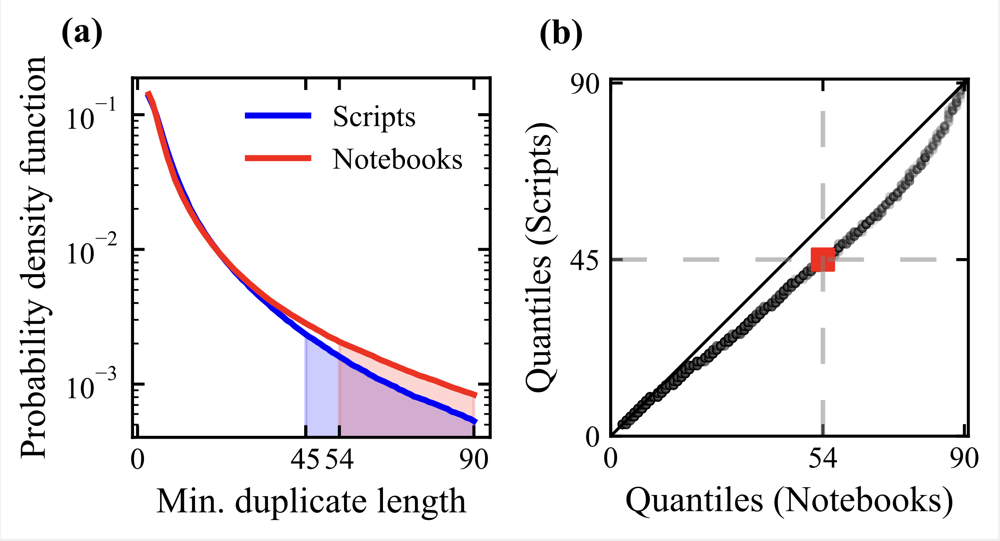

# Optimizing Duplicate Size Thresholds in IDEs

## Getting started

In order to replicate the study and inspect the results,
it is necessary to download and unpack the data,
and set up the environment.

### Setting up the environment

To set up the environment, use

```
poetry install
```

### Setting up the data

You can download the data from [Zenodo](https://doi.org/10.5281/zenodo.7572584).

Then, place the archives `archive_in` and `archive_out` in the `'data'` directory and unpack the archives 
using the `unzip_data` method:

```python
from utils.data_utils import unzip_data
unzip_data('data')
```

## Clone analysis

The experiment consists of several stages:

0. Deduplication
1. Aggregation and filtering clone data
2. Building probabilistic distribution
3. Empirical analysis

### Deduplication

The search for duplicates was carried out using our [suffix-tree algorithm for PSI](https://github.com/nbirillo/clone-detector/tree/python-clone-analysis). We used [Lupa](https://github.com/nbirillo/Lupa) in order to automate the deduplication process. For each deduplicated file, we got `.json` file which contains meta information about the processed file and a list of groups of clones detected in it, with a minimum clone length of 3 PSI elements.

### Aggregation and filtering

Firstly, for each file, we arrange all the clones in groups with every possible minial threshold. Next, we aggregate the data from these groups 
across all files into one table, which allows us to a distribution of minimal threshold to to the number of clones. 

At this step, it is also possible to filter out some clones. For example, we remove all fragments in Jupyter notebooks that include the cell separator, i. e., that include code from several cells. 

### Transforming data to a probabilistic distribution

After aggregating the clone data, we get the distribution of the number of clones for each minimum clone length. Next, we find the average of the distribution corresponding to each of the minimum length of the duplicate and thus obtain a single functional dependence for all — the average number
of clones to the minimum length of the duplicate.

We further transform the resulting functional dependence into a distribution mass function by normalization. It turns out that we are able to reduce two sets of data corresponding to different environments to some discrete random variables, which we will compare with each other.


### Empirical analysis

In [PyCharm](https://www.jetbrains.com/pycharm/), the default value for a minimal size for highlighting is 45 elements of the PSI tree. 
Our task was to find the optimal value for our notebook products — [Datalore](https://datalore.jetbrains.com/) and [DataSpell](https://www.jetbrains.com/dataspell/).
We decided to look for optimal corresponding value using quantile analysis. 
To compare clones in Python scripts and notebooks, we sampled 10,000 files of each type and calculated tje
distribution of minial clone sizes to the number of clones.


The idea of analysis consists of two steps:
1) we can find the quantile rank corresponding to the given optimal value in scripts — this quantile-rank is essentially the cumulative density function (CDF) of this value.
2) Next, it we find the corresponding quantile in the notebooks and infer its value in terms of PSI tree elements.

Mathematically, this can be described as follows:

$$\theta_{scripts} = 45 \to CDF_{scripts}(\theta_{scripts}) = p_{scripts}$$

$$CDF_{notebooks}^{-1} (p_{scripts}) = \theta_{notebooks}$$

All code and examples can be found in the `clones-study.ipynb` notebook.

